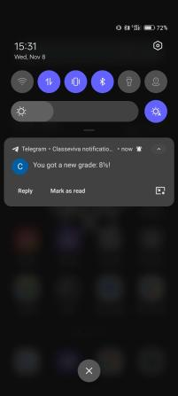

# Telegram bot for classeviva

## To run with node:

```bash
npm i && npm run build && npm start
```

## To run with Docker:

```bash
npm run dockerBuild && npm run dockerRun
```

- To see logs: `npm run dockerLogs`
- To stop: `npm run dockerStop`

#### <b>Note</b>: The hosting server should have an italian IP otherwhise classeviva login api will return an invalid response

<br />

# Working example bot username: @classeviva_voti_bot

## Commands:

    /help : list all available commands
    /info : show logged user info
    /login : login to your classeviva account
    /logout : logout from your classeviva account
    /grades : show all your logged account grades
    /subscribegrades : subscribe to new grades and receive notifications
    /unsubscribegrades : unsubscribe from receiving grade notifications

## Grade notification example:


